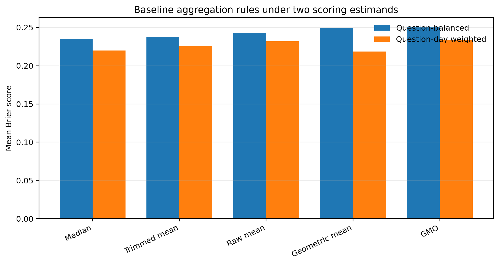
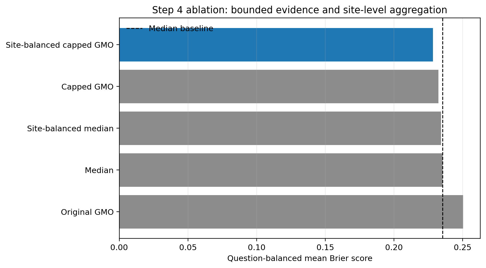
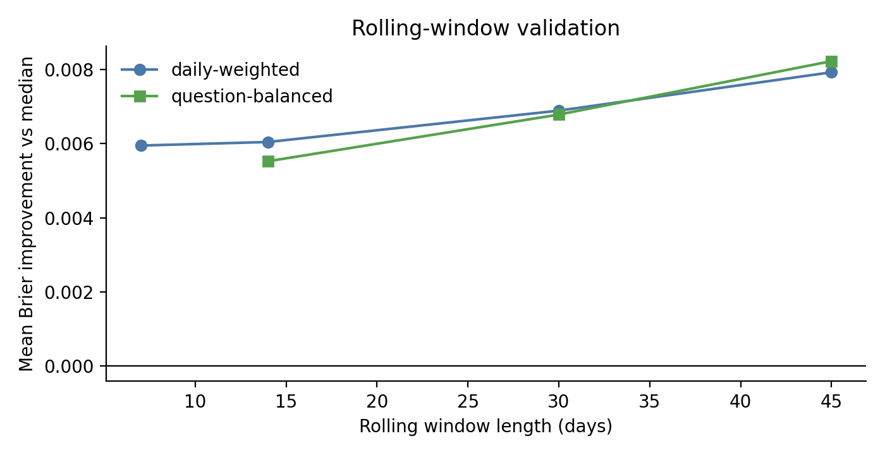

# Memo: Aggregating RCTA Individual Forecasts

## Executive Summary

This memo analyzes individual forecasts from the first-year HFC RCTA competition. The statistical problem is to construct, for each question-day, a crowd probability vector from individual forecasts and to compare aggregation rules by Brier loss. I reconstruct five baseline aggregation methods from `rct-a-prediction-sets.csv`, score them against outcomes from `rct-a-questions-answers.csv`, and then propose a sixth method: **site-balanced bounded evidence pooling**. The method clips individual probabilities to `[0.02, 0.98]`, pools clipped log-odds within forecasting site, and then combines sites with equal weight. In point estimate, it gives the best result among the tested rules under both scoring summaries: question-balanced Brier decreases from 0.235399 for the median baseline to 0.228379, and question-day weighted Brier decreases from 0.218701 for geometric mean to 0.211749. The paired bootstrap improvement over median is 0.0070198 with 95% interval `[-0.0003299, 0.0137224]`, so the gain is favorable but modest and should be interpreted as exploratory. In practical terms, the method keeps useful crowd agreement, but limits how much any one forecaster can move the aggregate and treats each forecasting platform as one information source rather than counting all of its members as independent evidence.

## 1. Data and Unit of Analysis

The raw RCTA data consist of three files. The questions-answers file contains question metadata, answer options, dates, and resolved outcomes. The prediction-sets file contains individual-level forecasts; a prediction set is one forecaster's submission for one question, with multiple rows for multi-option questions. The daily-forecasts file contains performer-method forecasts rather than individual forecasts, so it is not used as the source for aggregation.

The target unit is a question-day. Let \(q \in \{1,\ldots,Q\}\) index questions, \(t \in \mathcal{T}_q\) index scoring days for question \(q\), \(k \in \{1,\ldots,K_q\}\) index answer options, and \(i \in \mathcal{I}_{qt}\) index forecasters active for question-day \((q,t)\). Let \(s(i)\) denote the forecasting site of forecaster \(i\). I write

\[
\mathcal{S}_{qt}=\{s(i): i\in\mathcal{I}_{qt}\}, \qquad
n_{sqt}=|\{i\in\mathcal{I}_{qt}:s(i)=s\}|
\]

for the set of sites and the number of forecasters from site \(s\) on question-day \((q,t)\). The individual forecast vector is

\[
p_{iqt} = (p_{iqt1},\ldots,p_{iqtK_q}), \qquad \sum_{k=1}^{K_q}p_{iqtk}=1,
\]

and the resolved outcome vector is

\[
y_q = (y_{q1},\ldots,y_{qK_q}), \qquad y_{qk}\in[0,1], \qquad \sum_{k=1}^{K_q}y_{qk}=1.
\]

In the scored RCTA sample used here, resolved outcomes are effectively one-hot after filtering. For one-row binary questions, the stored answer option is interpreted as the focal Yes answer. I construct

\[
p_{iqt,\mathrm{No}} = 1-p_{iqt,\mathrm{Yes}}, \qquad
y_{q,\mathrm{No}} = 1-y_{q,\mathrm{Yes}}.
\]

The cleaned scored sample contains 189 questions and 13,129 question-days.

## 2. Cleaning and Scoring-Day Construction

Forecast rows were retained only if they had non-missing and valid forecast probabilities, non-missing resolved probabilities, valid question and prediction-set identifiers, valid answer identifiers, non-missing forecaster identifiers, non-missing timestamps, and were not marked as made after correctness was known. Timestamps were converted to America/New_York. The scoring day is defined by the HFC 2:01pm ET cutoff: forecasts before 2:01pm ET are assigned to that calendar day, while forecasts at or after 2:01pm ET are assigned to the next scoring day.

For each \((q,t,i)\), I selected the latest prediction set by timestamp and retained all answer rows from that prediction set. This preserves the vector-valued nature of multi-option submissions. Selecting answer rows independently would create artificial forecast vectors that no forecaster actually submitted. For multi-option questions, answer options were aligned across sites using answer sort order, because answer id in the prediction-set file is site-specific and not globally stable.

## 3. Loss Functions and Estimands

For binary and nominal questions, the Brier loss for an aggregate forecast \(\hat p_{qt}\) is

\[
L_{qt}(\hat p)=\sum_{k=1}^{K_q}(\hat p_{qtk}-y_{qk})^2.
\]

For binary questions this is the original 0-2 Brier scale:

\[
L_{qt}(\hat p)=
(\hat p_{\mathrm{Yes}}-y_{\mathrm{Yes}})^2+
(\hat p_{\mathrm{No}}-y_{\mathrm{No}})^2
=2(\hat p_{\mathrm{Yes}}-y_{\mathrm{Yes}})^2.
\]

For ordinal questions, I use the Jose-Nau-Winkler ordered Brier score. Let

\[
F_j = \sum_{k\le j}\hat p_{qtk}, \qquad
O_j = \sum_{k\le j}y_{qk}, \qquad j=1,\ldots,K_q-1.
\]

The ordered score is

\[
L^{\mathrm{ord}}_{qt}(\hat p)=
\frac{2}{K_q-1}\sum_{j=1}^{K_q-1}(F_j-O_j)^2.
\]

I report two empirical risk summaries. The question-day weighted risk is

\[
\widehat R_{\mathrm{QD}}(m)=
\frac{1}{\sum_q |\mathcal{T}_q|}
\sum_{q=1}^{Q}\sum_{t\in\mathcal{T}_q}
L_{qt}(\hat p^{(m)}_{qt}),
\]

where each scored question-day receives one vote. The question-balanced risk is

\[
\widehat R_{\mathrm{QB}}(m)=
\frac{1}{Q}\sum_{q=1}^{Q}
\left[
\frac{1}{|\mathcal{T}_q|}
\sum_{t\in\mathcal{T}_q}
L_{qt}(\hat p^{(m)}_{qt})
\right],
\]

where each question receives one vote regardless of how long it remained open. The local HFC scoring document clearly establishes daily Brier / MDB, but does not fully specify the second-stage aggregation for this work-test comparison. I therefore report both estimands.

## 4. Baseline Aggregation Operators

For each question-day and answer option, I compute five baseline aggregation rules. Let \(p_{ik}\) abbreviate \(p_{iqtk}\) within a fixed \((q,t)\). The raw mean is

\[
a_k=\frac{1}{n}\sum_{i=1}^n p_{ik}, \qquad
\hat p_k=\frac{a_k}{\sum_j a_j}.
\]

The median is

\[
a_k=\mathrm{median}_{i}(p_{ik}), \qquad
\hat p_k=\frac{a_k}{\sum_j a_j}.
\]

The geometric mean of probabilities is

\[
a_k=\exp\left(\frac{1}{n}\sum_{i=1}^n\log(\mathrm{clip}(p_{ik},\epsilon,1-\epsilon))\right),
\qquad
\hat p_k=\frac{a_k}{\sum_j a_j}.
\]

The trimmed mean removes the top and bottom 10% of scalar probabilities before averaging. The geometric mean of odds is implemented as one-vs-rest log-odds pooling:

\[
z_k=\frac{1}{n}\sum_{i=1}^n
\log\left[
\frac{\mathrm{clip}(p_{ik},\epsilon,1-\epsilon)}
{1-\mathrm{clip}(p_{ik},\epsilon,1-\epsilon)}
\right],
\qquad
a_k=\sigma(z_k),
\qquad
\hat p_k=\frac{a_k}{\sum_j a_j}.
\]

For binary questions, this reduces to

\[
\hat p_{\mathrm{Yes}}=\sigma\left(
\frac{1}{n}\sum_{i=1}^n \mathrm{logit}(p_{i,\mathrm{Yes}})
\right),
\qquad
\hat p_{\mathrm{No}}=1-\hat p_{\mathrm{Yes}}.
\]

For \(K_q>2\), Method 5 does not uniquely specify a multinomial odds geometry. I therefore use a simple one-vs-rest extension and renormalize to the simplex; the same extension is used consistently for the baseline GMO and the Step 4 method. The implementation uses \(\epsilon=10^{-6}\) for the original geometric and odds-based baselines.

## 5. Baseline Results

| Method | Question-Balanced Brier | Question-Day Weighted Brier |
|---|---:|---:|
| Median | 0.235399 | 0.219796 |
| Trimmed mean | 0.237679 | 0.225603 |
| Raw mean | 0.243280 | 0.231857 |
| Geometric mean | 0.249192 | 0.218701 |
| Geometric mean of odds | 0.250367 | 0.233909 |

The two estimands give different rankings. Under \(\widehat R_{\mathrm{QD}}\), geometric mean is best. Under \(\widehat R_{\mathrm{QB}}\), median is best. This reversal indicates a robustness tradeoff. Geometric methods perform well on many scored days, but they can incur large losses on a smaller number of questions. Median is more stable at the question level, but it does not accumulate evidence on a log scale.

## 6. Diagnostic Analysis

Before proposing an improved aggregation rule, I diagnosed which failure modes are supported by the data. As a secondary calibration diagnostic, I used a Murphy-style decomposition on option-level binary events, written on the standard 0-1 Brier scale as

\[
\mathrm{BS}=\mathrm{Reliability}-\mathrm{Resolution}+\mathrm{Uncertainty}.
\]

Reliability measures calibration error; resolution measures the ability to separate events from non-events. For median, the reliability share is 0.008. For GMO, it is 0.026. Thus the leading baselines are not dominated by calibration error.

| Diagnostic | Empirical result | Implication |
|---|---|---|
| Murphy decomposition | median rel_share = 0.008; GMO rel_share = 0.026 | Global recalibration / extremization has little target |
| Type stratification | binary 0.147, nominal 0.487, ordinal 0.253 under median question-day weighted scoring | Question geometry matters |
| Dispersion stratification | low dispersion 0.141, high dispersion 0.273 | Disagreement marks difficult question-days |
| Forecast age | same-day 0.219, one-day 0.220 | Much weaker than type and dispersion in this no-carry-forward pipeline |
| Staleness interpretation | retained forecasts are same-day or one-day latest submissions, not carried-forward stale forecasts | The pipeline limits what recency decay can change |

These diagnostics rule out the most standard improvement in the forecasting literature: global extremization. Extremization is useful when an average forecast is too close to 0.5 and should be pushed outward. Here, the leading baselines are not mainly underconfident. The problem is on the other side. Evidence-scale pooling is often useful, but unbounded log-odds evidence can become too extreme.

This gives the final method a clear relation to the literature. Extremization corrects under-accumulated evidence by moving an average forecast away from 0.5. Bounded evidence pooling corrects over-accumulated evidence by limiting how far one forecaster can move the log-odds average. They are mirror-image operations on the same calibration spectrum: one pushes a conservative aggregate outward, while the other pulls an overconfident evidence pool back inward.

## 7. Tested Conditional Improvements

I also tested the feature classes suggested by the prompt. The following table summarizes the decision from each diagnostic.

| Candidate direction | Statistical object | Result | Decision |
|---|---|---|---|
| Skill weighting | Prior resolved questions per active forecaster | First-half median = 3.5; second-half median = 16 | Not stable enough for season-wide use |
| Type-conditioned selection | Walk-forward best method by question type | Oracle improves slightly; walk-forward underperforms median | Hindsight structure is not deployable signal |
| Thin-crowd override | Switch method when \(n_{qt}\) is small | Best threshold mostly collapses to median | Not a meaningful improvement |
| Dispersion shrinkage | Shrink high-dispersion forecasts toward uniform | Brier worsens monotonically as shrinkage increases | Dispersion is a marker, not an intervention |
| Activity/update history | Forecaster activity and update history | Exploratory diagnostic only; no reproducible estimate in the main script | Not used in the final rule |

The negative results are important. They show that the final method is not a default fallback; it is chosen after plausible leakage-free alternatives fail for identifiable statistical reasons.

## 8. GMO Tail Autopsy

Let

\[
\Delta_{qt}=L_{qt}(\hat p^{\mathrm{GMO}})-L_{qt}(\hat p^{\mathrm{median}}).
\]

Negative \(\Delta_{qt}\) means GMO beats median on that question-day. GMO beats median on 68.0% of all question-days and 75.3% of binary question-days. However, positive excess loss is concentrated in a small number of questions. In binary questions, the worst 10 questions account for 85.2% of GMO's positive excess loss relative to median, and the worst 20 account for 97.0%.

This is the empirical basis for the final method. The issue is not that log-odds pooling is always poor. Rather, it is a high-variance evidence-pooling rule: often useful, occasionally catastrophic. Since the original GMO clips only at \(10^{-6}\), one near-certain forecast can contribute approximately \(\pm 13.8\) log-odds units. That is an implausibly large individual evidence contribution in geopolitical forecasting.

The relative-to-individual diagnostic gives the positive side of the same story. GMO's mean percentile rank among individual forecasters is 0.590 on binary question-days and 0.600 on ordinal question-days, compared with 0.447 and 0.563 for median. So GMO often extracts crowd signal better than the median. Its problem is not typical performance; it is tail risk.

## 9. Final Method: Site-Balanced Bounded Evidence Pooling

The final method modifies GMO in two ways. First, it bounds individual evidence. Second, it changes the aggregation unit from forecaster to site.

In plain language, I first limit how much any one forecaster can influence the aggregate by capping extreme probabilities. I then average forecasts within each forecasting site and combine sites with equal weight. This prevents one overconfident forecaster, or one large site, from dominating the crowd forecast.

Like the five baselines, the method aggregates the forecasts available for question \(q\) on scoring day \(t\), using the latest submissions available by the scoring cutoff. Unlike outcome-based skill weighting or walk-forward method selection, it has no learned historical parameter. Apart from the current forecasts being aggregated and fixed metadata such as site labels, it does not use future forecasts or resolved outcomes when constructing any individual question-day forecast.

The deployed formula uses a fixed cap \(c=0.02\). This cap was chosen after exploratory sensitivity checks on RCTA, so the reported gain should not be read as a fully held-out estimate. The stronger prospective design would pre-specify \(c\), or choose it by strict walk-forward validation.

For binary questions, set \(c=0.02\) and define

\[
p_i^{(c)}=\min\{\max(p_i,c),1-c\}.
\]

The individual bounded evidence is

\[
z_i^{(c)}=\mathrm{logit}(p_i^{(c)}).
\]

Within site \(s\), pool evidence by

\[
\bar z_s=\frac{1}{n_s}\sum_{i:s(i)=s} z_i^{(c)}.
\]

Across sites, combine site-level evidence by

\[
\bar z=\frac{1}{|\mathcal{S}_{qt}|}\sum_{s\in\mathcal{S}_{qt}}\bar z_s,
\qquad
\hat p_{\mathrm{Yes}}=\sigma(\bar z).
\]

For multi-option questions, I use the one-vs-rest extension. For each option \(k\),

\[
\bar z_{sk}=\frac{1}{n_s}\sum_{i:s(i)=s}\mathrm{logit}(p_{ik}^{(c)}),
\qquad
\bar z_k=\frac{1}{|\mathcal{S}_{qt}|}\sum_s \bar z_{sk},
\qquad
a_k=\sigma(\bar z_k),
\qquad
\hat p_k=\frac{a_k}{\sum_j a_j}.
\]

The cap \(c=0.02\) implies that no individual forecast contributes more than \(49:1\) odds. This is a modeling assumption, not merely a numerical safeguard. It says that individual near-certainty is treated as bounded evidence rather than an unbounded likelihood ratio.

The following sensitivity check varies the cap while keeping the same site-balanced structure. These rows are produced directly by `analysis.py`, using the same scoring code as the final method.

| Cap \(c\) | Maximum Individual Odds | Question-Balanced Brier |
|---:|---:|---:|
| 0.005 | 199:1 | 0.230249 |
| 0.010 | 99:1 | 0.228757 |
| 0.020 | 49:1 | 0.228379 |
| 0.050 | 19:1 | 0.232418 |

The site-level step is also substantive. HFC sites are best interpreted as partially distinct forecasting environments or performer systems, not ordinary demographic groups. Forecasters within a site may share platform design, information feeds, training, discussion environment, and machine assistance. Treating every forecaster as an independent evidence source can therefore over-count large sites.

## 10. Step 4 Results and Ablation

| Method | Question-Balanced Brier | Question-Day Weighted Brier | Interpretation |
|---|---:|---:|---|
| Median baseline | 0.235399 | 0.219796 | Robust baseline |
| Geometric mean baseline | 0.249192 | 0.218701 | Best q-day weighted baseline |
| Original GMO | 0.250367 | 0.233909 | Correct but fragile |
| Capped GMO 0.02 | 0.232327 | 0.216881 | Bounded evidence only |
| Site-balanced median | 0.234246 | 0.221594 | Site unit correction only |
| Site-balanced capped GMO 0.02 | 0.228379 | 0.211749 | Combined method |

The ablation supports the proposed mechanism. Bounding individual evidence improves over median. Site balancing alone gives a smaller improvement under question-balanced scoring. The combined method performs best, suggesting that individual-level overconfidence and site-level non-exchangeability are distinct failure modes.

By question type, the final method improves the median baseline under question-balanced scoring:

| Question Type | Median Baseline | Step 4 Method |
|---|---:|---:|
| Binary | 0.189982 | 0.179451 |
| Nominal | 0.478601 | 0.457898 |
| Ordinal | 0.244888 | 0.243401 |

The paired bootstrap over questions gives

\[
\widehat R_{\mathrm{QB}}(\mathrm{median})-\widehat R_{\mathrm{QB}}(\mathrm{Step4})
=0.0070198,
\]

with 95% interval `[-0.0003299, 0.0137224]`. The point estimate is favorable, but the interval slightly crosses zero. I therefore interpret the improvement as promising and mechanistically coherent, not as conclusive out-of-sample evidence.

## 11. Temporal Validation

Rolling-window checks ask whether the improvement is concentrated in a short period. They are not external validation, but they are useful temporal diagnostics.

| Window | Mean Improvement | Share Positive Windows |
|---|---:|---:|
| 7-day daily-weighted | 0.005949 | 0.690608 |
| 14-day daily-weighted | 0.006045 | 0.741379 |
| 30-day daily-weighted | 0.006891 | 0.797468 |
| 45-day daily-weighted | 0.007927 | 0.839161 |
| 14-day question-balanced | 0.005527 | 0.735632 |
| 30-day question-balanced | 0.006785 | 0.803797 |
| 45-day question-balanced | 0.008226 | 0.874126 |

The fixed method has positive mean improvement across all reported windows and is positive in roughly 69-87% of windows. This reduces the concern that the improvement is driven by a single short episode.

## 12. Limitations

The sample has only 189 scored questions, and the paired bootstrap interval crosses zero. The result should therefore be validated on another HFC season before being treated as a stable empirical law.

The cap \(c=0.02\) is interpretable, but still a modeling choice. The sensitivity table shows that nearby caps give similar performance, but a stronger design would pre-specify the cap or select it strictly by walk-forward validation.

The site-balanced component has two possible mechanisms: correcting within-site dependence and down-weighting weaker large sites. The data support both as plausible. This is a limitation for causal interpretation, although not necessarily for predictive performance.

The multi-option GMO extension is not unique. I use one-vs-rest odds pooling followed by normalization. Other log-evidence geometries, such as centered log-ratio pooling, may perform differently for nominal and ordinal questions.

Finally, the analysis does not carry forecasts forward. This is consistent with the question-day construction used here, but it limits conclusions about long-horizon staleness and recency decay.

## Conclusion

The main statistical finding is that the five baseline methods expose a tradeoff between evidence pooling and robustness. Geometric methods are strong under question-day weighting but vulnerable to per-question tail failures. Median is robust but does not pool evidence on the log-odds scale. Site-balanced bounded evidence pooling resolves this tradeoff by retaining log-odds evidence aggregation while bounding individual influence and correcting the unit of aggregation from forecaster to forecasting site. The resulting method improves both reported risk summaries and has a coherent statistical mechanism, though the size of the improvement should be interpreted conservatively.
